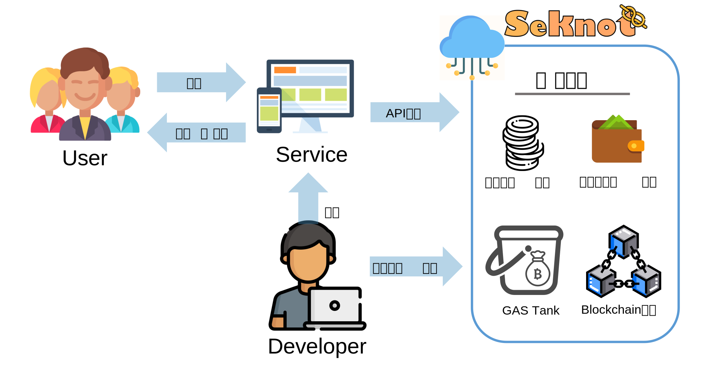
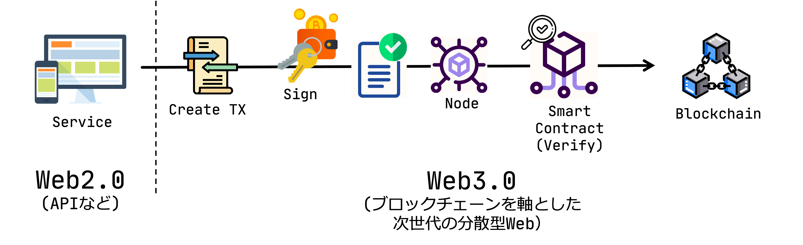
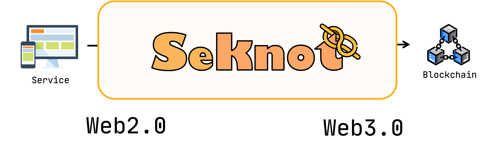

## Seknot について

「Seknot」はWeb開発者がブロックチェーンを手軽に扱えるよう、Web3の難しい部分を代替してAPI呼び出しによって簡単にトークンの発行・活用ができるプラットフォームです。
このプラットフォームを活用することによって、簡単にブロックチェーン上にトークンを発行して活用することができ、透明性・耐改竄性・拡張性を兼ね備えたブロックチェーンの特徴を活用したアプリを簡単に開発することができます。

## Seknot の目標

ブロックチェーン技術を中心とした非中央集権型のWebである**Web3.0**と、現在のAPIなどの技術による**Web2.0**とは使われている技術が大きく異なるため、現在のWeb2.0の開発者がWeb3.0に取り組むには高いハードルがありました。

Seknotでは、Web3.0に関わる難しい部分を代替し、現行の**Web2.0**のAPIによって**Web3.0**を扱えるようにすることを目指しています。
現状では、ブロックチェーン上におけるトークンの発行・活用のみにとどまっていますが、今後はこれを拡張させることで様々な形式のトークンを自由に発行できるようなプラットフォームを目指しています。
